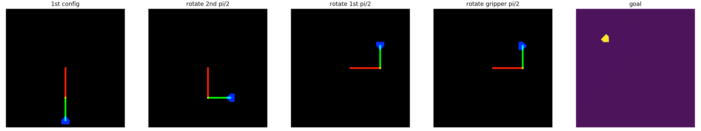
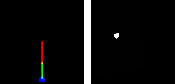

# 2R_Manipulator_Learner Report
## Environment
2 Revolute Joints System with Deep Reinforcement Learning.

In this project, I firstly implemented a simulated system of 2R Manipulator. 
The simulator is an environment with posibility of forward kinematic embedded method.
The simulator creates image configuration rather than a traditional joint angles configuration.
The manipulator always starts with 0 joint angles configuration and random goal location.
Sample image rotations and a sample goal configuration:


## New Features
- The code is updated to works with different starting joint angles.
- Able to control starting joint angles and goal position & orientation [manipulator.py#L137](https://github.com/gdao-research/2R_Manipulator_Learner/blob/master/manipulator.py#L137).

## Method
I applied a deep reinforcement learning method to solve the problem directly.
The algorithm used in this code is [Deep Deterministic Policy Gradient](https://arxiv.org/pdf/1509.02971.pdf).
This algorithm is seperated into two parts. 
The first part is an actor that is a neural network taking state (configuration) and output the action.
The second part is a critic that is a neural network taking state and action and output state-action (Q) value.
Q-value is a value that determine if a state-action is good to take or not. 
Higher Q-value is better action given a state.

However, due to the exploration problem, there is a bias in the training sample. 
For example, there is not likely to have reaching goal trajectory with random initialization of the neural networks.
This makes the learning becomes much harder because of the bias sampling.
I applied [Hindsight Experience Replay](https://arxiv.org/pdf/1707.01495.pdf).
This method creates a virtual goal within a given trajectory.
For example, a trajectory contains n steps, we can create several virtual goals with the goal location at k step where k < n.
This strategy balance between unsuccessful trajectories with successful trajectories for better learning performance.

The method solver is similar to inverse kinematic solver to create a "kind of" trajectory to solve a path planning problem.
However, this method solves directly from image based configuration instead of joint angles configuration.
At this stage, I just concentrated on making the solver works, so currently the path might **not** be optimal.
To make this run faster, I reduced the image size from 640 x 640 to 84 x 84 to reduce the computation time and have more test run with different hyper-parameters.

Please refer to [proposal](pdfs/Proposal.pdf) and [feedbac](pdfs/feedback.pdf) to get more information. Even though this is a simple problem, but approaching with deep reinforcement learning method seems to be promising direction.

## Experiment Result
The result reaches **100%** success rate of reaching different goal positions. An output of 50 episodes of the last evaluation (11401 steps) from [Demo](Demo.ipynb):



## Development Packages I Used
- Python 3.6.5
- TensorFlow 1.13.1
- NumPy 1.16.3
- OpenCV 4.1.0
- mpi4py 3.0.1 (for logger only)

## How to run
Set up hyper-parameters in [config.py](./config.py). To run the program:
```
python main.py
```
